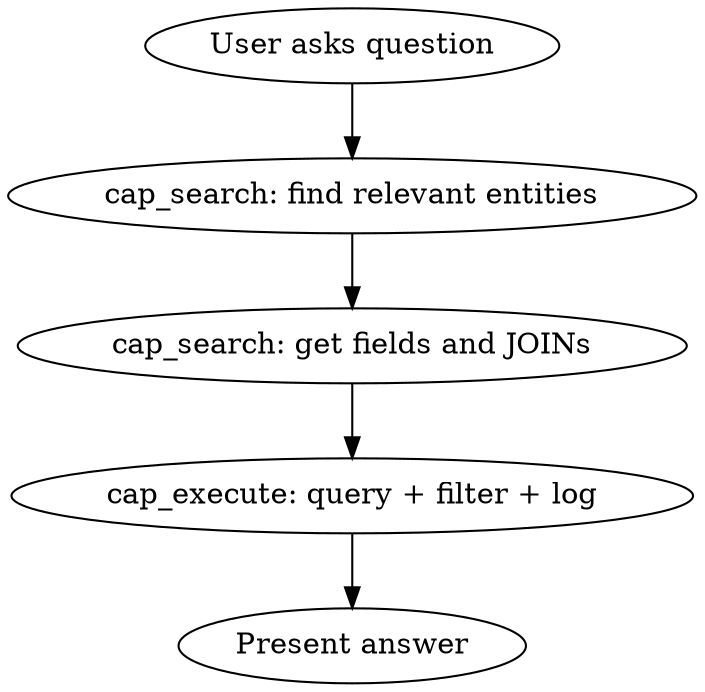

# CAP Code Mode — SFLIGHT MCP Recipes

## Overview

The sflight-mcp server exposes SAP SFLIGHT data (airlines, flights, bookings, passengers) through **2 Code Mode tools**. You write JavaScript to explore the schema (`cap_search`) and query data (`cap_execute`). Data stays in the sandbox — only what you `log()` reaches the model.

## When to Use

- Answering questions about airlines, flights, bookings, passengers, routes
- Exploring CDS entity structure, associations, services
- Running SQL analytics (occupancy, revenue, YoY growth, distributions)
- Building multi-step data pipelines (query + filter + transform)

## The Two Tools

| Tool | Purpose | Globals |
|------|---------|---------|
| `cap_search` | Explore CDS model | `model` (CSN), `tables` (string[]), `log()` |
| `cap_execute` | Query + transform data | `query(sql, maxRows?)`, `log()` |

## Discovery-First Workflow



**Always search before execute.** Discover entity names, column names, and JOIN conditions from the model before writing SQL.

## Quick Reference: cap_search Recipes

### List all entities
```javascript
const entities = Object.entries(model.definitions)
  .filter(([_, d]) => d.kind === 'entity')
  .map(([name, d]) => ({ name, fields: Object.keys(d.elements || {}).length }));
log(entities);
```

### Get entity fields and types
```javascript
const entity = model.definitions['flights.Flights'];
const fields = Object.entries(entity.elements || {})
  .filter(([_, e]) => e.type !== 'cds.Association' && e.type !== 'cds.Composition')
  .map(([name, e]) => ({ name, type: e.type, key: !!e.key }));
log(fields);
```

### Find associations (JOIN conditions)
```javascript
const entity = model.definitions['flights.Flights'];
const assocs = Object.entries(entity.elements || {})
  .filter(([_, e]) => e.type === 'cds.Association')
  .map(([name, e]) => ({ name, target: e.target, on: e.on }));
log(assocs);
```

### Search entities by keyword
```javascript
const matches = Object.entries(model.definitions)
  .filter(([name, d]) => d.kind === 'entity' && name.toLowerCase().includes('book'))
  .map(([name]) => name);
log(matches);
```

### Get SQL table names
```javascript
log(tables); // ['flights_Carriers', 'flights_Flights', ...]
```

## Quick Reference: cap_execute Recipes

### Simple query
```javascript
const rows = await query("SELECT CARRID, CARRNAME FROM flights_Carriers");
log(rows);
```

### Filtered query
```javascript
const rows = await query(`
  SELECT * FROM flights_Flights
  WHERE CARRID = 'LH' AND substr(FLDATE,1,4) = '2025'
  LIMIT 10
`);
log(rows);
```

### JOIN query
```javascript
const rows = await query(`
  SELECT c.CARRNAME, cn.CITYFROM, cn.CITYTO, cn.DISTANCE
  FROM flights_Connections cn
  JOIN flights_Carriers c ON c.MANDT = cn.MANDT AND c.CARRID = cn.CARRID
  ORDER BY cn.DISTANCE DESC LIMIT 10
`);
log(rows);
```

### Aggregation with JS post-processing
```javascript
const raw = await query(`
  SELECT c.CARRNAME, c.CARRID,
    ROUND(AVG(CAST(f.SEATSOCC AS FLOAT)/f.SEATSMAX*100), 1) as occ
  FROM flights_Flights f
  JOIN flights_Carriers c ON c.MANDT=f.MANDT AND c.CARRID=f.CARRID
  WHERE f.SEATSMAX > 0
  GROUP BY c.CARRID ORDER BY occ DESC
`);
log(raw.slice(0, 10)); // Top 10 only
```

### YoY growth (computed in JS)
```javascript
const years = await query(`
  SELECT substr(FLDATE,1,4) as year, COUNT(*) as cnt
  FROM flights_Bookings GROUP BY year ORDER BY year
`);
const enriched = years.map((r, i) => ({
  ...r,
  growth: i > 0
    ? ((r.cnt - years[i-1].cnt) / years[i-1].cnt * 100).toFixed(1) + '%'
    : '-'
}));
log(enriched);
```

### Multi-query composition
```javascript
const carriers = await query("SELECT CARRID, CARRNAME FROM flights_Carriers");
const stats = await query(`
  SELECT CARRID, COUNT(*) as flights, ROUND(AVG(PRICE),2) as avg_price
  FROM flights_Flights GROUP BY CARRID
`);
const merged = carriers.map(c => ({
  ...c,
  ...(stats.find(s => s.CARRID === c.CARRID) || {})
})).filter(c => c.flights).sort((a,b) => b.flights - a.flights);
log(merged);
```

## Key Tables

| Table | Key Columns | Rows |
|-------|-------------|------|
| flights_Carriers | CARRID | ~24 |
| flights_Connections | CARRID, CONNID | ~100 |
| flights_Flights | CARRID, CONNID, FLDATE | ~5,000 |
| flights_Bookings | CARRID, CONNID, FLDATE, BOOKID | ~10,000 |
| flights_Customers | ID | ~400 |
| flights_Planes | PLANETYPE | ~73 |
| flights_Airports | ID | ~30 |
| flights_TravelAgencies | AGENCYNUM | ~100 |

**Pre-joined views** (no JOINs needed): `flights_FlightSchedule`, `flights_BookingDetails`, `flights_CarrierConnections`, `flights_CustomerBusinessPartners`

## Common JOIN Patterns

| From | To | ON clause |
|------|----|-----------|
| Flights → Carriers | `c.MANDT=f.MANDT AND c.CARRID=f.CARRID` |
| Flights → Connections | `cn.MANDT=f.MANDT AND cn.CARRID=f.CARRID AND cn.CONNID=f.CONNID` |
| Bookings → Customers | `cu.MANDT=b.MANDT AND cu.ID=b.CUSTOMID` |
| Bookings → Flights | `f.MANDT=b.MANDT AND f.CARRID=b.CARRID AND f.CONNID=b.CONNID AND f.FLDATE=b.FLDATE` |
| Bookings → Agencies | `ta.MANDT=b.MANDT AND ta.AGENCYNUM=b.AGENCYNUM` |

**Tip:** Use `cap_search` to discover JOIN conditions dynamically from `model.definitions[entity].elements[assoc].on` rather than memorizing this table.

## Derived Metrics

```sql
-- Occupancy rate
CAST(SEATSOCC AS FLOAT) / SEATSMAX * 100

-- Empty seats
SEATSMAX - SEATSOCC

-- Revenue estimate
PRICE * SEATSOCC
```

## SQLite Date Functions

```sql
substr(FLDATE, 1, 4)     -- Year
substr(FLDATE, 1, 7)     -- Year-Month
FLDATE BETWEEN '2025-01-01' AND '2025-12-31'
```

## Common Mistakes

| Mistake | Fix |
|---------|-----|
| Writing SQL without knowing column names | Use `cap_search` first to discover fields |
| Logging entire result set (thousands of rows) | Filter in SQL (`LIMIT`) or JS (`.slice()`) before `log()` |
| Forgetting MANDT in JOINs | All tables have MANDT — include it in every JOIN condition |
| Using `require()` or `import` in sandbox | Not available; only pre-injected globals work |
| Hardcoding table names | Use `cap_search` to discover: `log(tables)` |
