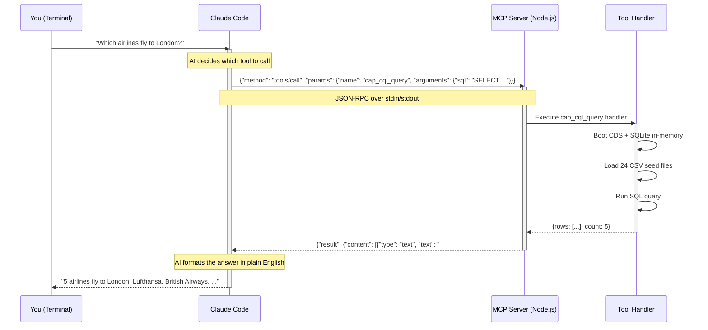
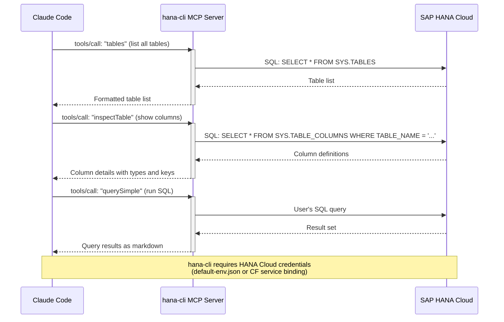
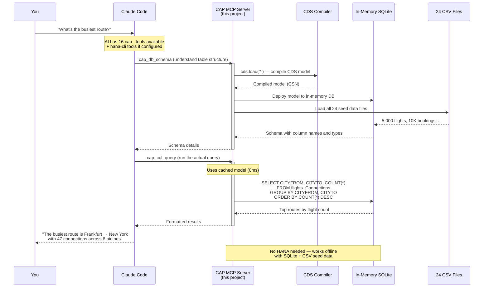

# SAP Flight Model — BTP CAP CDS

The classic SAP SFLIGHT data model — airlines, flights, bookings, passengers — reimagined as a modern **SAP BTP CAP CDS** application with an **AI-powered MCP server** built right in.

> Fork this repo, deploy to your BTP account, and start asking your data questions in plain English through Claude Code. No prior AI experience needed.

---

## What's Inside

| Layer | What It Does |
|-------|-------------|
| **26 Entities + 4 Views** | Airlines, flights, connections, bookings, customers, airports, meals, currencies — the complete SFLIGHT model in CDS |
| **59 Navigation Properties** | 5 compositions + 54 associations — fully navigable data model |
| **24 CSV Seed Data Files** | ~5,000 flights, 10,000+ bookings, 24 airlines, 15 destination cities (2023-2028) — ready to query immediately |
| **OData V4 Service** | REST API at `/odata/v4/flights` with full metadata, filtering, and expansion |
| **17-Tool MCP Server** | AI assistant that understands your data model, runs SQL queries, inspects schemas, and answers questions in plain English |
| **BTP-Ready Deployment** | MTA descriptor with XSUAA security, HANA Cloud HDI, and managed approuter |

---

## Quick Start (2 Minutes)

```bash
git clone https://github.com/AKS91/sflights-mcp.git
cd sflights-mcp
npm install
cds watch
```

Open [http://localhost:4004](http://localhost:4004) — you'll see the service running with all 26 entities and 4 views. That's it. The built-in SQLite database loads all 24 CSV files automatically.

**Try these URLs:**

| URL | What You'll See |
|-----|----------------|
| `/odata/v4/flights/$metadata` | Full OData metadata document |
| `/odata/v4/flights/Carriers` | All 24 airlines |
| `/odata/v4/flights/Flights?$top=5` | First 5 flight records |
| `/odata/v4/flights/Flights?$filter=CITYTO eq 'NEW YORK'` | Flights to New York |
| `/odata/v4/flights/getFlightsOnDate(flightDate=2025-03-15)` | Flights on a specific date |

---

## Setting Up AI-Powered Data Exploration

This is where it gets exciting. The built-in MCP server lets you ask questions about your flight data in plain English through **Claude Code** (Anthropic's AI coding assistant). Instead of writing SQL or OData queries yourself, you simply ask:

> *"Which airlines fly to London?"*
> *"What's the total passenger occupancy across all airlines?"*
> *"Show me the top 5 routes by number of bookings"*

Claude uses the 17 MCP tools behind the scenes to inspect the data model, run SQL queries, and give you formatted answers.

### What is MCP?

**MCP (Model Context Protocol)** is an open standard that lets AI assistants use tools. Think of it like a USB port for AI — it's a standard way to plug capabilities (tools) into an AI assistant. Instead of the AI guessing, it can actually look at your database schema, run real queries, and give you accurate answers.

### Step 1: Install Claude Code

Claude Code is a command-line AI assistant. Install it once:

```bash
npm install -g @anthropic-ai/claude-code
```

> You'll need an [Anthropic API key](https://console.anthropic.com/) or a Claude subscription.

### Step 2: Build the MCP Server

The MCP server lives inside this project at `mcp-server/`. Build it:

```bash
cd mcp-server
npm install
npm run build
cd ..
```

### Step 3: Configure Claude Code

Create a file called `.mcp.json` in the project root:

```json
{
  "mcpServers": {
    "cap-tools": {
      "command": "node",
      "args": ["<FULL-PATH-TO>/sflights-mcp/mcp-server/build/index.js"]
    }
  }
}
```

> Replace `<FULL-PATH-TO>` with the actual path on your machine.
> Example on Mac: `/Users/yourname/projects/sflights-mcp/mcp-server/build/index.js`
> Example on Windows: `C:/Users/yourname/projects/sflights-mcp/mcp-server/build/index.js`

### Step 4: Start Asking Questions

Open a terminal in the project folder and launch Claude Code:

```bash
claude
```

Now just ask questions in plain English:

```
You: Which airlines have the most passengers?
You: Show me all flights from Frankfurt to New York
You: What's the average ticket price by airline?
You: How many bookings were made in 2025?
```

Claude will use the MCP tools to query your data and give you formatted answers with actual numbers.

**Business users on Excel?** Claude for Excel can connect to this same data via MCP connectors. See [Claude for Excel Integration](docs/claude-for-excel.md).

### Example Questions (with SQL Patterns)

Not sure what to ask? Here are 10 real questions that the MCP server can answer, ordered by complexity:

| # | Question | SQL Pattern | Key Tables |
|---|----------|------------|------------|
| 1 | *"List all airlines and their currency"* | `SELECT CARRID, CARRNAME, CURRCODE FROM flights_Carriers` | Carriers |
| 2 | *"What currencies do airlines use?"* | `SELECT DISTINCT CURRCODE` | Carriers |
| 3 | *"Which airlines fly to New York?"* | 3-table JOIN: Carriers → Connections → Flights | Carriers, Connections, Flights |
| 4 | *"Average seat occupancy rate per airline"* | `JOIN + CAST(SEATSOCC AS FLOAT)/SEATSMAX*100 + AVG` | Flights, Carriers |
| 5 | *"Top 5 busiest routes by booking count"* | 4-table JOIN + `GROUP BY CITYFROM, CITYTO` + `ORDER BY COUNT(*) DESC` | Connections, Flights, Bookings, Carriers |
| 6 | *"Revenue estimate per airline"* | `SUM(PRICE * SEATSOCC)` grouped by carrier | Flights, Carriers |
| 7 | *"Flights with >80% occupancy"* | Derived column: `SEATSOCC*100.0/SEATSMAX > 80` | Flights, Carriers, Connections |
| 8 | *"Which travel agencies book the most?"* | `JOIN + COUNT + ORDER BY DESC` | Bookings, TravelAgencies |
| 9 | *"Monthly booking trends"* | `strftime('%Y-%m', FLDATE) + GROUP BY` | Bookings, Flights |
| 10 | *"Multi-hop route analysis (connecting flights)"* | Self-join on Connections: `c1.CITYTO = c2.CITYFROM` | Connections, Carriers |

> These questions are tested in `test/mcp-test-questions.sh`. The full 20-question test suite is in `test/mcp-questions.http`.

---

## MCP Server — 17 Tools

The MCP server provides 17 tools, all prefixed with `cap_`:

### Model Introspection
| Tool | What It Does |
|------|-------------|
| `cap_entities` | Lists all 26 entities + 4 views with key fields, associations, and compositions |
| `cap_entity_detail` | Full definition of any entity — all fields, types, and relationships |
| `cap_associations` | All 59 navigation properties with cardinality and target entities |
| `cap_nav_map` | Complete navigation graph with SQL JOIN ON clauses — essential for multi-table queries |
| `cap_services` | Service definitions with entity counts and function/action counts |

### Schema & Compilation
| Tool | What It Does |
|------|-------------|
| `cap_compile` | Compiles CDS to json, edmx, sql, hdbcds, hdbtable, or yaml |
| `cap_edm` | Generates OData V4 EDMX metadata document |

### Data Queries (SQL)
| Tool | What It Does |
|------|-------------|
| `cap_cql_query` | Runs any SQL query against in-memory SQLite with all seed data loaded |
| `cap_data_stats` | Row counts for every entity — see data volume at a glance |
| `cap_sample_data` | Preview rows from any entity — see actual values and column names |
| `cap_db_schema` | Complete database schema with column names, types, and keys |

### Project Management
| Tool | What It Does |
|------|-------------|
| `cap_csv_inspect` | Browse CSV seed data files and preview contents |
| `cap_project_info` | Package.json, CDS config, and all dependencies |
| `cap_mta_info` | MTA deployment descriptor details |
| `cap_build` | Run CDS build (development or production) |
| `cap_hana_mapping` | CDS entity to HANA artifact name mapping |
| `cap_query` | OData query against a running CAP service (requires `cds watch`) |

### Which MCP Server Should I Use?

| Scenario | MCP Server | Why |
|----------|-----------|-----|
| Local development (no database) | Built-in cap-tools (17 tools) | SQLite + CSV seed data, zero setup |
| Local with HANA Cloud | cap-tools + hana-cli | Both configured in `.mcp.json` |
| Deployed on BTP (API consumers) | OData V4 endpoint | Standard REST/OData at `/odata/v4/flights` |
| Business users (Excel) — local | supergateway + cap-tools | Wraps stdio→HTTP/SSE, see `scripts/start-mcp-sse.sh` |
| Business users (Excel) — production | gavdi/cap-mcp plugin | HTTP/SSE inside CAP server at `/mcp` |
| Quick PoC, no code changes | odata_mcp_go | Auto-discovers from `$metadata`, single binary |

> For detailed setup instructions, see [External Integration Paths](docs/integration-paths.md) and [Claude for Excel Integration](docs/claude-for-excel.md).

---

## How MCP Works — Architecture Diagrams

### 1. MCP Protocol — How AI Talks to Tools

This is the general pattern for any MCP server in JavaScript/TypeScript. The AI assistant (Claude Code) communicates with your tools through a standardized protocol over stdin/stdout:



**Key concept:** The AI doesn't guess — it actually runs real queries against your real data and gives you accurate answers.

### 2. hana-cli MCP Server — Direct Database Access

The `hana-cli` MCP server (a separate npm package) connects directly to SAP HANA Cloud and provides low-level database operations:



### 3. CAP MCP Server — Application-Level Intelligence

Our embedded CAP MCP server adds **application-level understanding** on top of raw database access. It knows about CDS entities, associations, OData services, and seed data — not just tables and columns:



**Why both servers?** Use them together for the best experience:
- **CAP MCP Server** — works offline, understands CDS models, great for development and data exploration
- **hana-cli MCP Server** — connects to live HANA Cloud, needed for production data and database administration

---

## Integration Guides

| Guide | Description |
|-------|------------|
| [Claude for Excel](docs/claude-for-excel.md) | Connect flight data tools to Claude's Excel add-in — business users query data in plain English from spreadsheets |
| [External Integration Paths](docs/integration-paths.md) | Three ways to connect external MCP servers: gavdi/cap-mcp (merged plugin), CData OData (standalone Java), odata_mcp_go (standalone Go) — architecture comparison and step-by-step setup |

---

## Deploying to SAP BTP Cloud Foundry

This section walks you through deploying the application to your own BTP account. You'll end up with a live OData service backed by HANA Cloud.

### Prerequisites

| What | Why |
|------|-----|
| SAP BTP account | [Get a free trial](https://www.sap.com/products/technology-platform/trial.html) or use your company's account |
| Cloud Foundry CLI | `brew install cloudfoundry/tap/cf-cli@8` (Mac) or [download here](https://github.com/cloudfoundry/cli/releases) |
| MTA Build Tool | `npm install -g mbt` |
| HANA Cloud instance | Needed for the database — provision one in BTP Cockpit |

### Step-by-Step Deployment

**1. Login to Cloud Foundry**

```bash
cf login -a https://api.cf.<YOUR-REGION>.hana.ondemand.com
# Example regions: us10, eu10, ap21
# Select your org and space when prompted
```

**2. Build the MTA archive**

```bash
npx cds build --production
mbt build
```

This creates a file like `mta_archives/sflights-mcp_1.0.0.mtar`.

**3. Deploy to Cloud Foundry**

```bash
cf deploy mta_archives/sflights-mcp_1.0.0.mtar
```

This single command:
- Creates the HANA HDI container and deploys all 26 tables + 4 views
- Loads all 24 CSV seed data files into HANA
- Deploys the Node.js OData service
- Sets up the approuter with XSUAA authentication
- Wires everything together

**4. Assign yourself the role collection**

In BTP Cockpit → Security → Role Collections:
- Assign `sflights-mcp-admin` or `sflights-mcp-viewer` to your user

**5. Access your service**

```bash
cf apps
# Note the URL for sflights-mcp-approuter
# Open: https://<your-approuter-url>/odata/v4/flights/$metadata
```

---

## Developing in SAP Business Application Studio (BAS)

BAS is SAP's cloud IDE — think VS Code in your browser, pre-configured for SAP development.

### Getting Started in BAS

1. **Open BAS** from your BTP Cockpit → Instances and Subscriptions → SAP Business Application Studio
2. **Create a Dev Space** → Choose "Full Stack Cloud Application" (includes CDS tools, CF CLI, and HANA tools)
3. **Clone the repo**:
   ```bash
   git clone https://github.com/AKS91/sflights-mcp.git
   cd sflights-mcp
   npm install
   ```
4. **Run locally in BAS**:
   ```bash
   cds watch
   ```
   BAS will offer to open a browser preview — click "Open in New Tab"

5. **Deploy from BAS** — BAS includes CF CLI pre-installed:
   ```bash
   cf login   # BAS often pre-configures the API endpoint
   npx cds build --production
   mbt build
   cf deploy mta_archives/sflights-mcp_1.0.0.mtar
   ```

### Using the MCP Server in BAS

BAS doesn't have Claude Code built in, but you can use it via the integrated terminal:

```bash
# In BAS terminal
cd mcp-server && npm install && npm run build && cd ..
npm install -g @anthropic-ai/claude-code
claude
```

---

## Desktop / Laptop Setup (VS Code)

### Prerequisites

| What | Install With | Version |
|------|-------------|---------|
| Node.js | [nvm](https://github.com/nvm-sh/nvm) or [download](https://nodejs.org/) | 18 or later |
| VS Code | [download](https://code.visualstudio.com/) | Latest |
| CDS Development Kit | `npm install -g @sap/cds-dk` | ^9 |
| Claude Code | `npm install -g @anthropic-ai/claude-code` | Latest |

### Setup Steps

```bash
# 1. Clone and install
git clone https://github.com/AKS91/sflights-mcp.git
cd sflights-mcp
npm install

# 2. Build the MCP server
cd mcp-server
npm install
npm run build
cd ..

# 3. Create your MCP config (see "Setting Up AI-Powered Data Exploration" above)
# 4. Start exploring!
cds watch        # Start the OData service (optional)
claude           # Start asking questions
```

### Connecting to HANA Cloud from Your Laptop (default-env.json)

When you develop locally but want to connect to your deployed HANA Cloud database (instead of the local SQLite), you need a `default-env.json` file. This file provides the same service credentials that Cloud Foundry injects automatically during deployment.

**Step 1: Get your HANA credentials**

```bash
# If you've already deployed, download the credentials from CF:
cf env sflights-mcp-srv
# Look for the VCAP_SERVICES section — copy the hana credentials
```

**Step 2: Create `default-env.json` in the project root**

```json
{
  "VCAP_SERVICES": {
    "hana": [
      {
        "name": "sflights-mcp-db",
        "label": "hana",
        "plan": "hdi-shared",
        "credentials": {
          "host": "your-hana-host.hanacloud.ondemand.com",
          "port": "443",
          "user": "YOUR_HDI_USER",
          "password": "YOUR_HDI_PASSWORD",
          "schema": "YOUR_HDI_SCHEMA",
          "certificate": "-----BEGIN CERTIFICATE-----\n...\n-----END CERTIFICATE-----",
          "driver": "com.sap.db.jdbc.Driver",
          "url": "jdbc:sap://your-hana-host:443?encrypt=true&validateCertificate=true"
        }
      }
    ]
  }
}
```

> **Security note:** `default-env.json` contains database credentials. It's already in `.gitignore` — never commit this file.

**Step 3: Run with HANA connection**

```bash
cds watch --profile production
```

Now your local server reads/writes from your HANA Cloud database.

**Alternative: Use `cds bind`**

If you have the CF CLI configured, there's an easier way:

```bash
# Bind to your deployed HDI service
cds bind --to sflights-mcp-db:sflights-mcp-db

# Run with hybrid profile (HANA DB + local server)
cds watch --profile hybrid
```

This creates a `.cdsrc-private.json` with encrypted credentials — no manual JSON editing needed.

---

## Data Model

### Entities (26)

| Category | Entities |
|----------|----------|
| Airlines & Fleet | Carriers, CarrierPlanes, Planes, CargoPlanes, PassengerPlanes |
| Connections & Flights | Connections, Flights |
| Bookings | Bookings, Tickets, Invoices |
| Customers | Customers, BusinessPartners |
| Travel | TravelAgencies, Counters |
| Airports & Geography | Airports, CityAirports, GeoCities |
| In-flight Meals | Meals, MealTexts, Menus, FlightMeals, Starters, MainCourses, Desserts |
| Currency | CurrencyRates, CurrencyDecimals |

### Views (4)

| View | Description |
|------|------------|
| CustomerBusinessPartners | Customers joined with their business partner details |
| CarrierConnections | Carriers with their connections and flight schedules |
| FlightSchedule | Denormalized view combining flights, connections, and carrier info |
| BookingDetails | Bookings joined with flight, connection, and customer data |

### Seed Data Profile

| Data Set | Volume |
|----------|--------|
| Airlines | 24 carriers (Lufthansa, Singapore Airlines, Delta, etc.) |
| Connections | Routes between 15+ cities worldwide |
| Flights | ~5,000 records (2023-2028, bulk in 2028) |
| Bookings | 10,000+ reservations |
| Customers | Individual and business travelers |
| Airports | Major international airports |

---

## Project Structure

```
sflights-mcp/
  db/
    schema.cds              # 26 entities + 4 views (CDS data model)
    data/                   # 24 CSV seed data files
    package.json            # HDI deployer config
  srv/
    flights-service.cds     # OData V4 service definition (26 entities + 4 views + 1 function)
    flights-service.js      # Custom handler: getFlightsOnDate()
  app/router/               # Managed approuter for BTP deployment
    xs-app.json             # Route config with XSUAA auth
  scripts/
    start-mcp-sse.sh        # Launch MCP server as HTTP/SSE for Claude for Excel
  test/
    mcp-test.sh             # MCP Inspector CLI tests for all 17 tools
    mcp-test-questions.sh   # 10 example SQL queries via MCP
    auth-test.sh            # OAuth2 token + BTP API call test
    odata-queries.http      # OData V4 query test suite (VS Code REST Client)
    mcp-questions.http      # 20 AI questions for Claude Code
  docs/                     # Integration guides
    claude-for-excel.md     # Claude for Excel integration (local + BTP)
    integration-paths.md    # External MCP server comparison (3 paths)
  mcp-server/               # AI-Powered MCP Server (17 tools)
    src/
      index.ts              # MCP Server class with stdio transport
      cap-tools.ts          # Tool definitions with schemas and handlers
      cds-executor.ts       # Hybrid execution engine (direct CDS binary + cache)
      output-formatter.ts   # Data to markdown table conversion
    scripts/
      query-runner.cjs      # CDS + SQLite query runner (boots in-memory DB)
  mta.yaml                  # MTA deployment descriptor (3 modules)
  xs-security.json          # XSUAA security config (admin + viewer roles)
  package.json              # Root project dependencies
```

---

## API Endpoints

Base URL (local): `http://localhost:4004`

| Method | Endpoint | Description |
|--------|----------|-------------|
| GET | `/odata/v4/flights/$metadata` | OData metadata document |
| GET | `/odata/v4/flights/Carriers` | All airlines |
| GET | `/odata/v4/flights/Flights?$top=10` | Flight records |
| GET | `/odata/v4/flights/Connections?$filter=CITYTO eq 'NEW YORK'` | Filtered connections |
| GET | `/odata/v4/flights/Carriers?$expand=CONNECTIONS` | Airlines with their routes |
| GET | `/odata/v4/flights/getFlightsOnDate(flightDate=2025-03-15)` | Flights on a specific date |

---

## Deployment Architecture

```
                    BTP Cloud Foundry
    ┌─────────────────────────────────────────┐
    │                                         │
    │  ┌──────────────┐   ┌───────────────┐   │
    │  │  Approuter   │──→│  OData V4     │   │
    │  │  (128 MB)    │   │  Service      │   │
    │  │  XSUAA Auth  │   │  (256 MB)     │   │
    │  └──────────────┘   └───────┬───────┘   │
    │                             │           │
    │                     ┌───────▼───────┐   │
    │                     │  HANA Cloud   │   │
    │                     │  HDI Container│   │
    │                     │  26 tables    │   │
    │                     │  4 views      │   │
    │                     │  24 CSV loads │   │
    │                     └───────────────┘   │
    │                                         │
    └─────────────────────────────────────────┘
```

**Three MTA Modules:**
1. **sflights-mcp-approuter** — Handles authentication via XSUAA, routes requests to the service
2. **sflights-mcp-srv** — Node.js CAP service exposing OData V4 APIs
3. **sflights-mcp-db-deployer** — Deploys CDS model to HANA Cloud HDI container

**Two BTP Services:**
- **XSUAA** — Authentication and authorization (role collections: `sflights-mcp-admin`, `sflights-mcp-viewer`)
- **HANA Cloud HDI** — Managed database container

---

## Origin

This project was transformed from [sflights-mcp](https://github.com/AKS91/sflights-mcp) — originally a HANA XSA HDI-only project with `.hdbcds` tables and `.hdbtabledata` imports. The transformation modernized it to SAP CAP CDS with full OData V4 services, BTP deployment, and AI-powered data exploration through MCP.

## License

MIT
