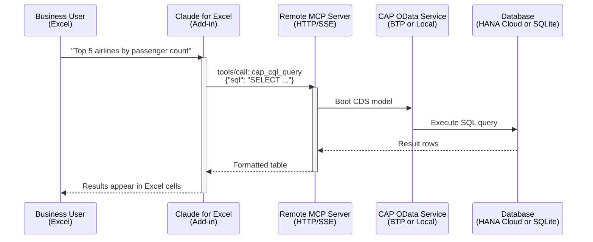

# Claude for Excel — Query Flight Data from a Spreadsheet

Business users can query this application's flight data in plain English — directly from Microsoft Excel — using **Claude for Excel** and MCP connectors.

> _"Show me all airlines with more than 80% seat occupancy"_
> — typed into Excel, answered with real data from your SAP system.

---

## What is Claude for Excel?

| Detail           | Info                                                                                              |
| ---------------- | ------------------------------------------------------------------------------------------------- |
| **What**         | Anthropic's official Microsoft Excel add-in — Claude AI inside your spreadsheets                  |
| **Plans**        | Pro, Max, Team, Enterprise                                                                        |
| **Install**      | [Microsoft Marketplace](https://marketplace.microsoft.com/en-us/product/saas/wa200009404)         |
| **Capabilities** | Read multi-tab workbooks, edit cells, create pivot tables/charts, answer questions, run MCP tools |
| **MCP Support**  | Yes — connects to remote MCP servers via organization-level custom connectors                     |

`★ Insight ─────────────────────────────────────`
Claude for Excel doesn't just read your spreadsheet — it can call external tools via MCP connectors. This means it can reach out to your SAP CAP service, run SQL queries, and bring the results directly into Excel cells. No copy-pasting from a terminal.
`─────────────────────────────────────────────────`

---

## How It Works — Architecture



**The key piece:** Your MCP server needs to be accessible over HTTP/SSE (not just stdio) for Claude for Excel to reach it. Here are three ways to do that:

---

## Three Approaches to Connect

| Approach                                  | How                                                                        | Effort                           | Best For                                |
| ----------------------------------------- | -------------------------------------------------------------------------- | -------------------------------- | --------------------------------------- |
| **1. gavdi/cap-mcp plugin** (Recommended) | Install npm plugin in CAP project. Exposes `/mcp` endpoint alongside OData | Add dependency + CDS annotations | Teams already deploying to BTP          |
| **2. odata_mcp_go bridge**                | Run standalone Go binary in HTTP/SSE mode, point at OData URL              | Download binary + configure      | Quick proof-of-concept, no code changes |
| **3. stdio-to-SSE proxy**                 | Wrap existing MCP server with `mcp-proxy` or `supergateway`                | npm install + launch command     | Reuse existing 17-tool MCP server as-is |

---

## Recommended Setup: gavdi/cap-mcp Plugin

This is the most SAP-native path. The plugin runs inside your CAP server and exposes an MCP endpoint that Claude for Excel can connect to.

### Step 1: Install the Plugin

```bash
cd sflights-mcp
npm install @gavdi/cap-mcp
```

### Step 2: Add MCP Annotations to Your Service

In `srv/flights-service.cds`, annotate entities you want business users to query:

```cds
using flights from '../db/schema';

service FlightsService @(path: '/odata/v4/flights') {

    @mcp: { name: 'carriers', description: 'Airlines with fleet and route information',
            resource: ['filter', 'orderby', 'select', 'top', 'expand'] }
    entity Carriers as projection on flights.Carriers;

    @mcp: { name: 'flights', description: 'Flight schedules with pricing and occupancy',
            resource: ['filter', 'orderby', 'select', 'top'] }
    entity Flights as projection on flights.Flights;

    @mcp: { name: 'bookings', description: 'Passenger bookings with customer details',
            resource: ['filter', 'orderby', 'select', 'top', 'expand'] }
    entity Bookings as projection on flights.Bookings;

    // ... add @mcp to other entities as needed
}
```

> **Note:** `@mcp` annotations are type-specific: use `resource` for entities, `tool` for functions/actions, and `prompts` for service-level prompt templates. Do not put `@mcp` on the `service` definition unless providing `prompts`.

### Step 3: Configure in package.json

```json
{
  "cds": {
    "mcp": {
      "name": "sflights-mcp",
      "auth": "inherit"
    }
  }
}
```

### Step 4: Deploy and Register the Connector

After deploying to BTP Cloud Foundry, the MCP endpoint will be available at:

```
https://<your-approuter-url>/mcp
```

Register this URL in your Claude organization settings:

1. Go to claude.ai → Organization Settings → Connectors
2. Add a Custom Connector with the MCP server URL
3. Business users with Claude for Excel will see the tools automatically

### Step 5: Business Users Query from Excel

Once connected, business users open Excel, activate the Claude add-in, and ask:

| Question                                          | What Happens                                                  |
| ------------------------------------------------- | ------------------------------------------------------------- |
| _"List all airlines sorted by name"_              | Claude calls the `carriers` resource with `$orderby=CARRNAME` |
| _"How many bookings in Q1 2025?"_                 | Claude queries `bookings` with date filter                    |
| _"Show flights to New York with occupancy > 80%"_ | Claude uses `flights` resource with compound filter           |
| _"Which airline has the most passengers?"_        | Claude may call multiple resources and aggregate              |

---

## Alternative: stdio-to-SSE Proxy

If you want to expose the existing 17-tool MCP server (with SQL queries, model introspection, etc.) to Claude for Excel without the cap-mcp plugin:

```bash
# Install a proxy that converts stdio MCP to HTTP/SSE
npm install -g supergateway

# Run the proxy
supergateway --stdio "node mcp-server/build/index.js" --port 8080
```

This exposes all 17 `cap_` tools over HTTP/SSE at `http://localhost:8080`. Register this URL as a custom connector in Claude org settings.

> **Note:** For production, deploy the proxy as a Cloud Foundry app or run it on a server accessible to your users.

---

## Local Testing (supergateway)

Test the Excel integration locally before deploying to BTP. This wraps the existing 17-tool MCP server as HTTP/SSE.

### Quick Start

```bash
# 1. Build the MCP server (if not already built)
cd mcp-server && npm run build && cd ..

# 2. Start the HTTP/SSE wrapper
bash scripts/start-mcp-sse.sh
# Server runs at http://localhost:8080
```

### Verify It Works

```bash
# In another terminal — should establish SSE connection
curl http://localhost:8080/sse
```

### Connect Claude for Excel

1. Go to [claude.ai](https://claude.ai) → Organization Settings → Connectors
2. Add Custom Connector → URL: `http://localhost:8080`
3. Open Excel → Claude add-in → Ask a question like _"List all airlines"_

> **Note:** `localhost` only works when Excel runs on the same machine. For team testing, use your machine's IP or deploy to BTP (next section).

### Environment Variable

Override the default port with `MCP_SSE_PORT`:

```bash
MCP_SSE_PORT=9090 bash scripts/start-mcp-sse.sh
```

---

## BTP Production Deployment (gavdi/cap-mcp)

For production access from Claude for Excel, the gavdi/cap-mcp plugin embeds an MCP endpoint inside the deployed CAP service. This project is already configured — here's what was set up:

### What's Configured

| File                      | Change                                                                                                                                                               |
| ------------------------- | -------------------------------------------------------------------------------------------------------------------------------------------------------------------- |
| `package.json`            | `@gavdi/cap-mcp` dependency + `cds.mcp` configuration                                                                                                                |
| `srv/flights-service.cds` | `@mcp` annotations on 10 key entities (Carriers, Flights, Bookings, Connections, Customers, TravelAgencies, Airports, CarrierPlanes, FlightSchedule, BookingDetails) |
| `app/router/xs-app.json`  | `/mcp` route forwarding to srv module                                                                                                                                |

### Deploy to BTP

```bash
# Install the new dependency
npm install

# Build and deploy
npx cds build --production
mbt build
cf deploy mta_archives/sflights-mcp_1.0.0.mtar
```

### After Deployment

The MCP endpoint is available at:

```
https://0ef2ec95trial-dev-sflights-mcp-approuter.cfapps.us10-001.hana.ondemand.com/mcp
```

Register this URL as a custom connector in Claude org settings. XSUAA auth flows through automatically — the plugin inherits CAP's auth configuration.

### Test Locally First

```bash
cds watch
# MCP endpoint: http://localhost:4004/mcp
# OData endpoint: http://localhost:4004/odata/v4/flights
```

---

## Comparison: Our MCP Server vs. gavdi/cap-mcp

| Aspect               | Our Custom MCP Server (17 tools)                             | gavdi/cap-mcp Plugin                         |
| -------------------- | ------------------------------------------------------------ | -------------------------------------------- |
| **Data source**      | In-memory SQLite with CSV seed data                          | Live OData against HANA Cloud                |
| **Model awareness**  | Deep — CDS compilation, navigation map, schema introspection | OData-level — entity sets and properties     |
| **Query capability** | Full SQL (JOINs, aggregations, subqueries)                   | OData query options ($filter, $expand, etc.) |
| **Offline mode**     | Yes — works without HANA or running server                   | No — requires running CAP service            |
| **Transport**        | stdio (needs proxy for Excel)                                | HTTP/SSE native                              |
| **Best for**         | Developers exploring the model, complex analytics            | Business users querying live production data |

**Recommendation:** Use both. Our custom MCP server for development and deep analysis. The cap-mcp plugin for business user access to live data via Claude for Excel.

---

## Limitations

- **Claude for Excel MCP connectors** require organization-level configuration (Admin/Owner role needed)
- **Auth propagation** — The MCP endpoint inherits CAP auth, so XSUAA tokens must flow through. The cap-mcp plugin handles this with `"auth": "inherit"`
- **Complex analytics** — Multi-step aggregations (e.g., "year-over-year growth") may work better through our custom SQL-based MCP server than through OData queries
- **Data volume** — Claude for Excel works best with result sets under a few thousand rows. For large extracts, use traditional Excel OData connectors or export tools
