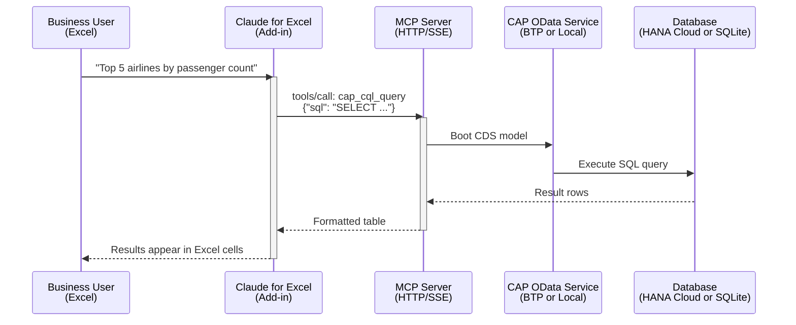

# Claude for Excel — Query Flight Data from a Spreadsheet

Business users can query this application's flight data in plain English — directly from Microsoft Excel — using **Claude for Excel** and MCP connectors.

> _"Show me all airlines with more than 80% seat occupancy"_
> — typed into Excel, answered with real data from your SAP system.

---

## What is Claude for Excel?

| Detail           | Info                                                                                              |
| ---------------- | ------------------------------------------------------------------------------------------------- |
| **What**         | Anthropic's official Microsoft Excel add-in — Claude AI inside your spreadsheets                  |
| **Plans**        | Pro, Max, Team, Enterprise                                                                        |
| **Install**      | [Microsoft Marketplace](https://marketplace.microsoft.com/en-us/product/saas/wa200009404)         |
| **Capabilities** | Read multi-tab workbooks, edit cells, create pivot tables/charts, answer questions, run MCP tools |
| **MCP Support**  | Yes — connects to remote MCP servers via custom connectors                                        |

> **Key insight:** MCP connectors can be registered at two levels:
> - **Personal** — added by any Claude user in their own `claude.ai` settings. No admin needed.
> - **Organization** — added by an org admin, shared across the whole team.
>
> For testing and demos, use personal connectors. Promote to org-level once you're ready to share.

---

## How It Works — Architecture



---

## Testing Without an Org Admin — Two Paths

You do not need an org admin to test Claude for Excel. You can register a connector in your **personal** `claude.ai` settings and test end-to-end on your own. Two paths are available depending on whether you want to run the MCP server locally or use the deployed BTP app.

| | Path A — Local Desktop | Path B — BTP Deployed |
|---|---|---|
| **Data source** | SQLite + CSV seed data (offline) | HANA Cloud (live data) |
| **MCP tools** | 19 `cap_` tools (full SQL, analytics) | 10 OData tools (`@mcp`-annotated entities) |
| **Needs BTP deployed?** | No | Yes |
| **Needs org admin?** | No | No |
| **Keep terminal open?** | Yes (while using Excel) | No |
| **Best for** | Developer demo, offline testing | Business user demo with live data |

---

## Path A — Local Desktop (No BTP, No Admin)

Everything runs on your machine. Excel and the MCP server are both local, so `localhost` works directly.

### Architecture

```
Your Desktop
┌─────────────────────────────────────────────────────────────┐
│                                                             │
│  Excel                                                      │
│    └─► Claude for Excel add-in                              │
│            └─► http://localhost:8080   (personal connector) │
│                    │                                        │
│            supergateway (SSE bridge)                        │
│                    │                                        │
│            mcp-server/build/index.js  (19 cap_ tools)       │
│                    │                                        │
│            SQLite in-memory + 24 CSV files                  │
│            (~5,000 flights, 10,000+ bookings)               │
│                                                             │
│  Terminal 1: cds watch  (optional — needed only for         │
│              cap_query tool, not for SQL-based tools)        │
│  Terminal 2: start-mcp-sse  (required — keeps SSE running)  │
│                                                             │
└─────────────────────────────────────────────────────────────┘
```

### Step 1 — One-Time Setup

Clone the repo and install dependencies. Run this once per machine.

**macOS / Linux / WSL2:**
```bash
git clone https://github.com/MindsetConsulting/sflight-mcp.git
cd sflight-mcp
bash scripts/setup.sh
```

**Windows (PowerShell):**
```powershell
git clone https://github.com/MindsetConsulting/sflight-mcp.git
cd sflight-mcp
powershell -ExecutionPolicy Bypass -File scripts\setup.ps1
```

Both scripts install dependencies, build the MCP server, and create `.mcp.json`.

### Step 2 — Start the SSE Bridge

This wraps the stdio MCP server as an HTTP/SSE endpoint that Claude for Excel can connect to. **Keep this terminal open** while using Excel.

**macOS / Linux / WSL2** (Terminal window):
```bash
bash scripts/start-mcp-sse.sh
# Server starts at http://localhost:8080
```

**Windows** (PowerShell window):
```powershell
powershell -ExecutionPolicy Bypass -File scripts\start-mcp-sse.ps1
# Server starts at http://localhost:8080
```

Custom port (both platforms):
```bash
# macOS/Linux
MCP_SSE_PORT=9090 bash scripts/start-mcp-sse.sh

# Windows PowerShell
$env:MCP_SSE_PORT=9090; powershell -ExecutionPolicy Bypass -File scripts\start-mcp-sse.ps1
```

Expected output:
```
===========================================================
  sflight-mcp  MCP Server -> HTTP/SSE  (supergateway)
===========================================================

  Listening on:
    SSE:    http://localhost:8080/sse
    Health: http://localhost:8080/

  Register http://localhost:8080 in claude.ai
    → Settings → Integrations → Add MCP Server
```

### Step 3 — Verify the SSE Endpoint

In a second terminal, confirm the server is reachable:

**macOS / Linux:**
```bash
curl -N http://localhost:8080/sse
# Should open an SSE stream — press Ctrl+C to close
```

**Windows (PowerShell):**
```powershell
Invoke-WebRequest http://localhost:8080/ -TimeoutSec 3
# Should return HTTP 200
```

### Step 4 — Register as Your Personal Connector

This adds the MCP server to **your own account** only — no org admin required.

1. Open [https://claude.ai](https://claude.ai) in a browser
2. Click your avatar (top right) → **Settings**
3. Navigate to **Integrations** (the exact label may show as *MCP Servers* depending on your plan)
4. Click **Add MCP Server** (or **Add custom integration**)
5. Enter:
   - **Name:** `sflight-mcp-local` (or any name)
   - **URL:** `http://localhost:8080`
6. Save — Claude will connect and discover the tools automatically

> **Note:** `localhost` works because both Excel and the MCP server run on the same machine.
> If testing from a colleague's machine, use your IP address instead: `http://192.168.x.x:8080`.

### Step 5 — Query from Excel

1. Open Excel
2. **Insert → Add-ins → Claude for Excel** (install from Microsoft Marketplace if first time)
3. In the Claude panel, your `sflight-mcp-local` connector appears
4. Ask questions:

| Try asking... | What happens |
|---|---|
| *"List all airlines sorted by name"* | Calls `carriers` tool with `$orderby` |
| *"Which airlines fly to New York?"* | Runs a SQL JOIN across Carriers → Connections → Flights |
| *"Show me the top 5 routes by booking count"* | Runs aggregation query across 4 tables |
| *"How many flights were operated in 2025?"* | Filters Flights by FLDATE year |
| *"Average seat occupancy per airline"* | `SUM(SEATSOCC)/SUM(SEATSMAX)` grouped by carrier |

---

## Path B — BTP Deployed (Live HANA Data, No Admin)

Use this when the app is already deployed on BTP and you want to test with real HANA Cloud data. No local server needed.

### Architecture

```
Your Desktop                          BTP Cloud Foundry
┌───────────────────┐                 ┌──────────────────────────────────┐
│                   │                 │                                  │
│  Excel            │                 │  Approuter                       │
│   └─► Claude for  │  HTTPS          │   /mcp route                     │
│       Excel       ├────────────────►│   authenticationType: none       │
│           │       │                 │        │                         │
│    Personal       │                 │   @gavdi/cap-mcp plugin          │
│    connector      │                 │   (10 OData tools)               │
│    (no admin)     │                 │        │                         │
│                   │                 │   CAP OData Service              │
│                   │                 │   FlightsService (@open)         │
│                   │                 │        │                         │
└───────────────────┘                 │   HANA Cloud HDI                 │
                                      │   (live data)                    │
                                      │                                  │
                                      └──────────────────────────────────┘
```

> **Auth note:** The `/mcp` route has `authenticationType: none` and the service is annotated `@open`.
> This allows unauthenticated access to the MCP endpoint while the `/odata/v4/flights` route
> remains fully protected by XSUAA. Revert when an admin can assign the `sflights-mcp-viewer`
> role collection to users.

### Step 1 — Find Your Approuter URL

```bash
cf apps
# Look for: sflights-mcp-approuter
# URL format: https://<subdomain>-dev-sflights-mcp-approuter.cfapps.<region>.hana.ondemand.com
```

Or check BTP Cockpit → Cloud Foundry → Spaces → Applications → `sflights-mcp-approuter`.

### Step 2 — Verify the MCP Endpoint

```bash
# Should return MCP server info (no auth token needed after the @open change)
curl https://<your-approuter-url>/mcp

# List available tools
curl -s -X POST https://<your-approuter-url>/mcp \
  -H "Content-Type: application/json" \
  -d '{"jsonrpc":"2.0","id":1,"method":"tools/list"}' \
  | jq '.result.tools[].name'
```

Expected: 10 tool names (`carriers`, `flights`, `bookings`, `connections`, `customers`, `travel-agencies`, `airports`, `carrier-planes`, `flight-schedule`, `booking-details`).

### Step 3 — Register as Your Personal Connector

Same steps as Path A Step 4, but use the BTP URL:

1. Open [https://claude.ai](https://claude.ai) → Settings → Integrations
2. **Add MCP Server**
3. Enter:
   - **Name:** `sflight-mcp-btp`
   - **URL:** `https://<your-approuter-url>/mcp`
4. Save

### Step 4 — Query from Excel

Same as Path A Step 5. Questions are answered using live HANA Cloud data instead of SQLite seed data.

---

## What Each Path Exposes

| Aspect | Path A — Local | Path B — BTP |
|---|---|---|
| MCP implementation | Custom 19-tool server (`mcp-server/`) | `@gavdi/cap-mcp` plugin |
| Tool names | `cap_cql_query`, `cap_entities`, `cap_nav_map`, ... | `carriers`, `flights`, `bookings`, ... |
| Query type | Raw SQL (any JOIN, aggregation, subquery) | OData ($filter, $expand, $orderby, $top) |
| Data source | SQLite + CSV seed data | HANA Cloud (live) |
| Offline? | Yes | No — needs deployed app |
| Auth | None (localhost) | None (temporarily — `@open`) |

---

## Promoting to Full Team Access (When Admin is Available)

Once you have demonstrated the integration and an org admin is ready:

### 1. Re-enable XSUAA Auth (revert the temporary `@open` changes)

In [app/router/xs-app.json](../app/router/xs-app.json), change the `/mcp` route back:
```json
{
  "source": "^/mcp(.*)$",
  "target": "/mcp$1",
  "destination": "srv-api",
  "authenticationType": "xsuaa"
}
```

In [srv/flights-service.cds](../srv/flights-service.cds), remove the `@open` annotation and its comment (lines 3–5).

### 2. Assign Role Collections to Users

In BTP Cockpit → Security → Users:
- Assign `sflights-mcp-viewer` to each user who needs read access
- Assign `sflights-mcp-admin` to users who need full access

### 3. Register as an Org-Level Connector

In [claude.ai](https://claude.ai) → **Organization Settings** → Connectors → Add Custom Connector:
- **URL:** `https://<your-approuter-url>/mcp`
- **Auth:** OAuth 2.0
  - Authorization URL: `https://<subdomain>.authentication.<region>.hana.ondemand.com/oauth/authorize`
  - Token URL: `https://<subdomain>.authentication.<region>.hana.ondemand.com/oauth/token`
  - Client ID / Secret: from the XSUAA service key in BTP Cockpit

Each user then clicks **Authorize** → logs in with their SAP BTP email and password → connected. They never interact with OAuth2 directly.

---

## Three Approaches to Connect MCP to Claude for Excel

| Approach | How | Effort | Best For |
|---|---|---|---|
| **1. gavdi/cap-mcp plugin** (Recommended) | Embedded in CAP server. Exposes `/mcp` alongside OData. | npm dep + CDS annotations | BTP-deployed apps, live data |
| **2. odata_mcp_go bridge** | Standalone Go binary. HTTP/SSE mode. Points at OData URL. | Download binary + configure | Quick PoC, zero code changes |
| **3. stdio-to-SSE proxy (supergateway)** | Wraps existing 19-tool MCP server as HTTP/SSE. | `npm install` + launch script | Reuse full custom server locally |

> For setup details on paths 2 and 3, see [External Integration Paths](integration-paths.md).

---

## Comparison: Custom MCP Server vs. gavdi/cap-mcp Plugin

| Aspect | Custom MCP Server (19 tools) | gavdi/cap-mcp Plugin (10 tools) |
|---|---|---|
| **Data source** | In-memory SQLite + CSV seed data | Live OData against HANA Cloud |
| **Model awareness** | Deep — CDS compilation, nav map, schema introspection | OData-level — entity sets and properties |
| **Query capability** | Full SQL (JOINs, aggregations, subqueries) | OData ($filter, $expand, etc.) |
| **Offline mode** | Yes — works without HANA or running server | No — requires running CAP service |
| **Transport** | stdio (needs supergateway for Excel) | HTTP/SSE native |
| **Best for** | Developers, complex analytics, offline demos | Business users with live HANA data |

**Recommendation:** Use both. Custom MCP server for development and demos. The cap-mcp plugin for business user production access.

---

## Scripts Reference

| Script | Platform | Purpose |
|---|---|---|
| `scripts/start-mcp-sse.sh` | macOS / Linux / WSL2 | Start SSE bridge on port 8080 |
| `scripts/start-mcp-sse.ps1` | Windows (PowerShell) | Start SSE bridge on port 8080 |
| `scripts/setup.sh` | macOS / Linux / WSL2 | One-time setup (deps + build) |
| `scripts/setup.ps1` | Windows (PowerShell) | One-time setup (deps + build) |

---

## Troubleshooting

| Problem | Likely Cause | Fix |
|---|---|---|
| Connector not appearing in Excel | Claude for Excel not refreshed | Close and reopen the Claude panel in Excel |
| `localhost` connector not connecting | SSE server not running | Check Terminal 2 is still running `start-mcp-sse` |
| BTP `/mcp` returns 401 | `@open` + `authenticationType:none` not deployed | Redeploy with `mbt build && cf deploy` |
| BTP `/mcp` returns 404 | Route missing from `xs-app.json` | Check the `/mcp` route is present |
| Tools not found | Wrong URL registered | Verify URL matches what supergateway printed |
| `npx supergateway` fails | npx cache issue | Run `npm install -g supergateway` then retry |
| Port 8080 already in use | Another process | Use `MCP_SSE_PORT=9090` env variable |
| Excel can't reach `localhost` on macOS | macOS network restrictions | Use `127.0.0.1:8080` instead of `localhost:8080` |

---

## Limitations

- **Claude for Excel** requires a Pro, Max, Team, or Enterprise Claude subscription
- **Personal connectors** — registration UI labels vary slightly by Claude plan and version; look for *Integrations*, *MCP Servers*, or *Custom connectors* in Settings
- **`localhost` URLs** only work when Excel runs on the same machine as the MCP server
- **Complex analytics** — multi-step aggregations (year-over-year growth, etc.) work better through the custom SQL-based MCP server than through OData queries
- **Data volume** — Claude for Excel works best with result sets under a few thousand rows
