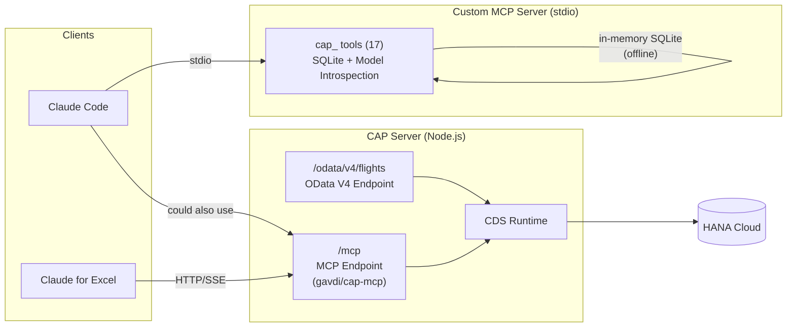
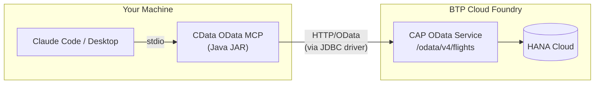
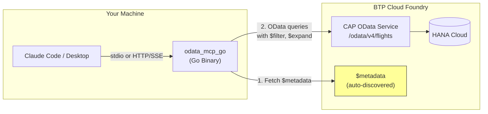

# External Integration Paths — MCP Servers for SAP CAP OData

Three approaches to connect external MCP servers to the sflights-mcp CAP OData V4 service. Each serves different use cases and can run alongside the built-in 17-tool MCP server.

---

## Quick Comparison

| Aspect                  | Path 1: gavdi/cap-mcp                                                   | Path 2: CData OData MCP                                                                               | Path 3: odata_mcp_go                                        |
| ----------------------- | ----------------------------------------------------------------------- | ----------------------------------------------------------------------------------------------------- | ----------------------------------------------------------- |
| **Architecture**        | Middleware inside CAP server                                            | Standalone Java process                                                                               | Standalone Go binary                                        |
| **Deployment**          | Merged into your app                                                    | Separate process                                                                                      | Separate process                                            |
| **Install**             | `npm install @gavdi/cap-mcp`                                            | Clone + `mvn install`                                                                                 | Download binary                                             |
| **Runtime**             | Node.js (same as CAP)                                                   | Java (JRE required)                                                                                   | Go (single binary)                                          |
| **Transport**           | HTTP/SSE (native)                                                       | stdio only                                                                                            | stdio or HTTP/SSE                                           |
| **Tool generation**     | From `@mcp` CDS annotations                                             | 3 fixed tools                                                                                         | Auto from $metadata                                         |
| **Auth**                | Inherits CAP auth (XSUAA)                                               | JDBC connection string                                                                                | Basic/Cookie/CSRF                                           |
| **CRUD**                | Full (respects CDS auth)                                                | Read-only                                                                                             | Full CRUD                                                   |
| **OData version**       | V4 (native CAP)                                                         | V2 + V4 (via JDBC driver)                                                                             | V2 + V4                                                     |
| **$expand support**     | Yes (via OData resources)                                               | No (SQL only)                                                                                         | Yes (native)                                                |
| **Code changes needed** | Add npm dep + CDS annotations                                           | Zero                                                                                                  | Zero                                                        |
| **Claude for Excel**    | Yes (HTTP/SSE native)                                                   | No (stdio + Java)                                                                                     | Yes (HTTP/SSE mode)                                         |
| **License**             | MIT                                                                     | CData JDBC driver license                                                                             | MIT                                                         |
| **GitHub**              | [gavdilabs/cap-mcp-plugin](https://github.com/gavdilabs/cap-mcp-plugin) | [CDataSoftware/odata-mcp-server-by-cdata](https://github.com/CDataSoftware/odata-mcp-server-by-cdata) | [oisee/odata_mcp_go](https://github.com/oisee/odata_mcp_go) |

---

## Path 1: gavdi/cap-mcp — CAP MCP Plugin (Merged)

### Architecture

The plugin runs **inside** the CAP server as middleware. It adds an `/mcp` HTTP/SSE endpoint alongside your existing OData endpoint. No separate process needed.



### How It Fits With This Application

| Aspect                             | Detail                                                                                                                              |
| ---------------------------------- | ----------------------------------------------------------------------------------------------------------------------------------- |
| **Relationship to our MCP server** | Complementary — they solve different problems                                                                                       |
| **Our MCP server**                 | Offline model introspection, SQL queries against SQLite seed data, deep CDS analysis                                                |
| **cap-mcp plugin**                 | Live OData queries against running HANA Cloud, auto-generated tools from CDS annotations                                            |
| **Can they coexist?**              | Yes — register both in `.mcp.json`. Claude Code uses our custom server for development. Claude for Excel uses cap-mcp for live data |
| **Deployment**                     | Plugin deploys WITH your CAP app (same CF app, same MTA)                                                                            |

### Setup Steps

**1. Install the plugin:**

```bash
cd sflights-mcp
npm install @gavdi/cap-mcp
```

**2. Add MCP annotations to service entities** (`srv/flights-service.cds`):

```cds
service FlightsService @(path: '/odata/v4/flights') {

    @mcp: { name: 'carriers', description: 'Airlines with fleet and route information',
            resource: ['filter', 'orderby', 'select', 'top', 'expand'] }
    @cds.redirection.target
    entity Carriers as projection on flights.Carriers;

    @mcp: { name: 'flights', description: 'Flight schedules with pricing and occupancy',
            resource: ['filter', 'orderby', 'select', 'top'] }
    @cds.redirection.target
    entity Flights as projection on flights.Flights;

    @mcp: { name: 'bookings', description: 'Passenger bookings with customer and flight details',
            resource: ['filter', 'orderby', 'select', 'top', 'expand'] }
    @cds.redirection.target
    entity Bookings as projection on flights.Bookings;

    @mcp: { name: 'connections', description: 'Flight routes between cities',
            resource: ['filter', 'orderby', 'select', 'top', 'expand'] }
    entity Connections as projection on flights.Connections;

    // Add @mcp to other entities as needed...
}
```

**3. Configure in package.json:**

```json
{
  "cds": {
    "mcp": {
      "name": "sflights-mcp",
      "auth": "inherit",
      "wrap_entities_to_actions": false
    }
  }
}
```

**4. Test locally:**

```bash
cds watch
# MCP endpoint available at http://localhost:4004/mcp
# Test with MCP Inspector:
npx @modelcontextprotocol/inspector
```

**5. Deploy to BTP** — no extra MTA modules needed, the plugin rides with the srv module.

### Strengths

- Most SAP-native solution — follows CAP plugin conventions
- Inherits XSUAA auth automatically
- HTTP/SSE transport — works with Claude for Excel out of the box
- Annotation-driven — fine-grained control over what's exposed

### Limitations

- Requires code changes (annotations)
- Queries go through OData — no raw SQL or complex aggregations
- Requires running CAP service (no offline mode)

---

## Path 2: CData OData MCP Server (Standalone)

### Architecture

A **separate Java process** that connects to any OData endpoint via a CData JDBC driver. Runs alongside Claude Desktop as a stdio MCP server.



### How It Fits With This Application

| Aspect                             | Detail                                                                                       |
| ---------------------------------- | -------------------------------------------------------------------------------------------- |
| **Relationship to our MCP server** | Independent — runs as a separate process                                                     |
| **Code changes**                   | Zero — points at the running OData URL                                                       |
| **Coexistence**                    | Register both in `.mcp.json` — CData for live OData queries, our server for offline analysis |
| **Deployment**                     | CData runs locally on developer machines only (not deployed to BTP)                          |

### Setup Steps

**1. Prerequisites:**

- Java Runtime Environment (JRE 8+)
- CData JDBC Driver for OData (requires license from CData)

**2. Build the server:**

```bash
git clone https://github.com/CDataSoftware/odata-mcp-server-by-cdata.git
cd odata-mcp-server-by-cdata
mvn clean install
```

**3. Configure connection** — create `odata.prp`:

```properties
DriverPath=/path/to/cdata-jdbc-odata.jar
DriverClass=cdata.jdbc.odata.ODataDriver
JdbcUrl=jdbc:odata:URL=http://localhost:4004/odata/v4/flights;ODataVersion=4.0
Tables=Carriers,Flights,Connections,Bookings,Customers
```

**4. Register in Claude Desktop config** (`claude_desktop_config.json`):

```json
{
  "mcpServers": {
    "sflights-cdata": {
      "command": "java",
      "args": [
        "-jar",
        "/path/to/CDataMCP-jar-with-dependencies.jar",
        "/path/to/odata.prp"
      ]
    }
  }
}
```

### Tools Exposed

Only 3 tools (fixed, not auto-generated):

| Tool                | Purpose                     |
| ------------------- | --------------------------- |
| `odata_get_tables`  | List all entity sets        |
| `odata_get_columns` | Column metadata for a table |
| `odata_run_query`   | Execute a SQL SELECT query  |

### Strengths

- Zero code changes to your CAP project
- Works with any OData endpoint (not just CAP)
- SQL query interface — familiar for data analysts

### Limitations

- **Read-only** (open source version)
- Only 3 tools — no model awareness, no schema introspection
- Requires Java + CData JDBC license
- stdio only — doesn't work with Claude for Excel
- Less intelligent than our custom MCP server (no JOIN hints, no navigation map)

---

## Path 3: Universal OData-MCP Bridge — odata_mcp_go (Standalone)

### Architecture

A **standalone Go binary** that auto-discovers your OData entities from the `$metadata` document and generates MCP tools for each one. The most powerful standalone option.



### How It Fits With This Application

| Aspect                             | Detail                                                                                               |
| ---------------------------------- | ---------------------------------------------------------------------------------------------------- |
| **Relationship to our MCP server** | Independent — runs as a separate process                                                             |
| **Code changes**                   | Zero — reads $metadata automatically                                                                 |
| **Auto-generated tools**           | One tool per entity: `filter_Carriers`, `get_Flights`, `create_Bookings`, etc.                       |
| **Coexistence**                    | Register both in `.mcp.json`. Bridge for live CRUD, our server for offline SQL + model introspection |
| **Deployment**                     | Runs locally or as an HTTP/SSE server for team access                                                |

### Setup Steps

**1. Download the binary:**

```bash
# macOS (Apple Silicon)
curl -L -o odata-mcp https://github.com/oisee/odata_mcp_go/releases/latest/download/odata-mcp-darwin-arm64
chmod +x odata-mcp

# Or build from source
git clone https://github.com/oisee/odata_mcp_go.git
cd odata_mcp_go && go build -o odata-mcp
```

**2. Test with local CAP service:**

```bash
# Start CAP service first
cd sflights-mcp && cds watch &

# Run the bridge (stdio mode for Claude Code)
./odata-mcp --service http://localhost:4004/odata/v4/flights/ --read-only
```

**3. Register in Claude Code** (`.mcp.json`):

```json
{
  "mcpServers": {
    "cap-tools": {
      "command": "node",
      "args": ["mcp-server/build/index.js"]
    },
    "flights-odata": {
      "command": "./odata-mcp",
      "args": [
        "--service",
        "http://localhost:4004/odata/v4/flights/",
        "--read-only",
        "--tool-shrink"
      ]
    }
  }
}
```

**4. For Claude for Excel** (HTTP/SSE mode):

```bash
./odata-mcp --service http://localhost:4004/odata/v4/flights/ \
            --transport sse --port 8080 --read-only
# Register http://localhost:8080 as a custom connector in Claude org settings
```

**5. For BTP production:**

```bash
./odata-mcp --service https://<approuter-url>/odata/v4/flights/ \
            --user <service-account> --password <password> \
            --read-only
```

### Tools Auto-Generated

For our 26 entities + 4 views, the bridge generates ~60 tools in standard mode:

| Tool Pattern      | Example           | Purpose                                    |
| ----------------- | ----------------- | ------------------------------------------ |
| `filter_<Entity>` | `filter_Carriers` | Query with $filter, $select, $expand, $top |
| `get_<Entity>`    | `get_Flights`     | Get single record by key                   |
| `create_<Entity>` | `create_Bookings` | Create new record (if not read-only)       |
| `update_<Entity>` | `update_Bookings` | Update existing record                     |

In `--universal` mode, all operations collapse into a single `odata` tool — reducing token overhead by ~97%.

### Strengths

- **Zero code changes** — reads $metadata and generates everything
- **Full CRUD** support (can be restricted to read-only)
- **$expand, $filter, $orderby** — full OData query support
- **SAP-aware** — handles CSRF tokens, GUIDs, SAP annotations
- **HTTP/SSE transport** — works with Claude for Excel
- **Single binary** — no runtime dependencies
- Most powerful standalone option

### Limitations

- No CDS-level intelligence (doesn't know about associations by name, only $metadata)
- Generates many tools in standard mode (use `--universal` or `--entities` to control)
- Auth must be configured explicitly (no XSUAA token propagation out of the box)
- Requires the OData service to be running

---

## Recommendation Matrix

| Scenario                                    | Recommended Path       | Why                                                         |
| ------------------------------------------- | ---------------------- | ----------------------------------------------------------- |
| **Business users querying from Excel**      | Path 1 (gavdi/cap-mcp) | HTTP/SSE native, inherits XSUAA auth, deploys with your app |
| **Quick proof-of-concept, no code changes** | Path 3 (odata_mcp_go)  | Download binary, point at URL, done in 2 minutes            |
| **Team already using CData tools**          | Path 2 (CData)         | Consistent with existing CData JDBC ecosystem               |
| **Developer exploring data model**          | Built-in MCP server    | 17 tools with SQL, navigation map, model introspection      |
| **Production deployment on BTP**            | Path 1 + Built-in      | cap-mcp for live data, built-in for development             |
| **Maximum power, zero changes**             | Path 3 (odata_mcp_go)  | Auto-discovers everything, full CRUD, SAP-aware             |
| **Offline development, no database**        | Built-in MCP server    | SQLite in-memory with CSV seed data                         |

---

## Using Multiple MCP Servers Together

You can register all servers simultaneously. Claude Code will choose the right tool for each question:

```json
{
  "mcpServers": {
    "cap-tools": {
      "command": "node",
      "args": ["mcp-server/build/index.js"],
      "_comment": "17 tools: model introspection, SQL queries, navigation map"
    },
    "flights-odata": {
      "command": "./odata-mcp",
      "args": [
        "--service",
        "http://localhost:4004/odata/v4/flights/",
        "--read-only"
      ],
      "_comment": "Auto-generated OData tools with $expand support"
    },
    "hana-cli": {
      "command": "node",
      "args": ["/path/to/hana-cli/mcp-server/build/index.js"],
      "_comment": "Direct HANA Cloud access for database administration"
    }
  }
}
```

**How Claude chooses:**

- _"Show me the data model"_ → `cap_entities` (built-in)
- _"What JOINs connect Flights to Bookings?"_ → `cap_nav_map` (built-in)
- _"Get Carriers with their Connections expanded"_ → `filter_Carriers` (odata_mcp_go) or `cap_query` (built-in)
- _"Average occupancy by airline"_ → `cap_cql_query` (built-in SQL)
- _"List HANA database tables"_ → `tables` (hana-cli)
